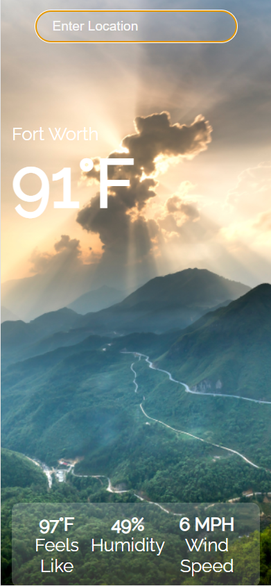

  # React Weather App
  

  
  ## Table-of-Contents
  * [Description](#description)
  * [Installation](#installation)
  * [Usage](#usage)
  * [Questions](#questions)

[Open](https://choosealicense.com/licenses/Open)

 
  ## [Description](#table-of-contents)
  Mobile Weather App using React and calling upon the OpenWeatherAPI to ensure live data. Users are able to input a city and receive Temp, Wind Speed, and Humidity. 
   
  

  ## [Installation](#table-of-contents)
  Use this link to view the application --> [Live Application](https://burnsd.github.io/react-weather/)

  ## [Usage](#table-of-contents)
  Use the search bar at the top of the application to find a city you would liike current weather data from.

  ## [License](#table-of-contents)
  This application has the following license:
  [Open](https://choosealicense.com/licenses/Open)
    
  ## [Questions](#table-of-contents)
  Contact me with any questions at the following:
  [GitHub](https://github.com/BurnsD)
  [Email: Contact@DustinBurnsDev.com](mailto:Contact@DustinBurnsDev.com)
  